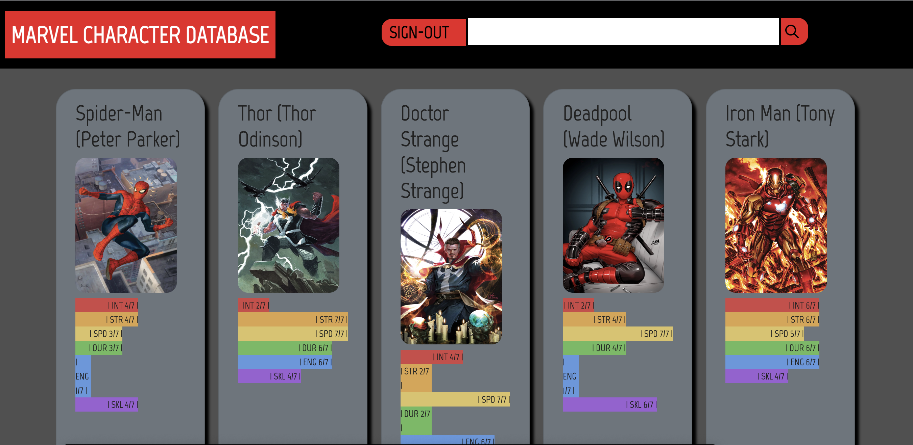

# marvel-team-builder

## Description: 

- Being avid fans of the Marvel universe, we sought to build an app that would not only ignite enthusiasm but also serve as a valuable resource. Our concept is to empower users to assemble their own Avengers team with the help of the detailed information readily available within our app's database.

- Our project was designed to empower both novice and veteran Marvel fans by providing a simple and user-friendly platform to browse and construct their very own Avengers team. With this app, users can channel their inner superhero mastermind and experience the thrill of assembling their own team.

- Marvel characters have been the subject of a plethora of information sources, making it challenging for fans to find a comprehensive database. Thus, we took on the task of constructing a database that brings together all the necessary information in one place. Our database is easy to use, providing users with the convenience of browsing, reading, and comparing data all in one platform.

- Working on this project we learned how to create our own restful api and pull information from it to display on a page. We also gained experience with styling the page and technologies that were new to us like SCSS and Chart.CSS.We also gained knowledge in creating routes in VS code to form a fully functional app.

## Installation 
- Our application is now fully seeded and operational, thanks to its deployment through Heroku. This means that users can start using the app immediately without any need for installation

## Usage
- To access our platform, users must first complete a sign-in form upon page load. Once signed in, they will be taken to our main database of Marvel characters, where they can browse a vast selection of heroes and build their own ultimate Avengers team.

[Preview of login page](assets/images/screenshot-login.png)

[Link to GitHub repo for our project](https://github.com/anthonylieu/marvel-team-builder)


## Visuals
 ```md
    
    ```

## Credits
Anthony Lieu - [GitHub Profile](https://github.com/anthonylieu)
Sean Haboon - [GitHub Profile](https://github.com/shaboon)
Sean Holian - [GitHub Profile](https://github.com/seannoway)
Beyonce Kinston - [GitHub Profile](https://github.com/BeyonceKinston)

## License 
The Marvel Team Builder App is licensed under the MIT License. You are free to use, modify, and distribute the app as you see fit, as long as you include the original license and copyright notices.

(https://img.shields.io/badge/MySQL-005C84?style=for-the-badge&logo=mysql&logoColor=white)
(https://img.shields.io/badge/Bootstrap-563D7C?style=for-the-badge&logo=bootstrap&logoColor=white)
(https://img.shields.io/badge/Node.js-339933?style=for-the-badge&logo=nodedotjs&logoColor=white)
(https://img.shields.io/badge/npm-CB3837?style=for-the-badge&logo=npm&logoColor=white)
(https://img.shields.io/badge/Sass-CC6699?style=for-the-badge&logo=sass&logoColor=white)
(ps://img.shields.io/badge/Slack-4A154B?style=for-the-badge&logo=slack&logoColor=white)
(https://img.shields.io/badge/Zoom-2D8CFF?style=for-the-badge&logo=zoom&logoColor=white)
(https://img.shields.io/badge/VSCode-0078D4?style=for-the-badge&logo=visual%20studio%20code&logoColor=white)
(https://img.shields.io/badge/HTML5-E34F26?style=for-the-badge&logo=html5&logoColor=white)
(https://img.shields.io/badge/JavaScript-323330?style=for-the-badge&logo=javascript&logoColor=F7DF1E)
(https://img.shields.io/badge/json-5E5C5C?style=for-the-badge&logo=json&logoColor=white)
(https://img.shields.io/badge/Deepin-007CFF?style=for-the-badge&logo=deepin&logoColor=white)
(https://img.shields.io/badge/GitHub-100000?style=for-the-badge&logo=github&logoColor=white)